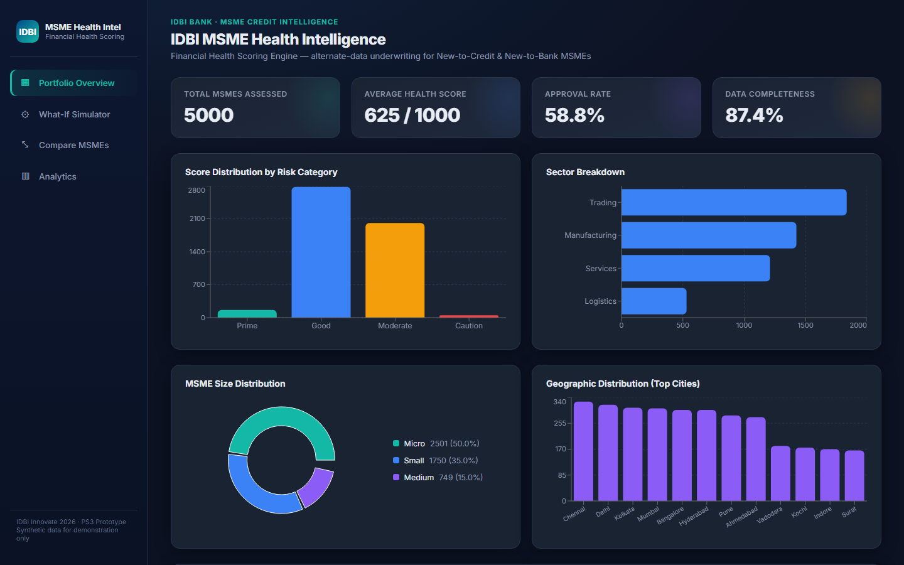
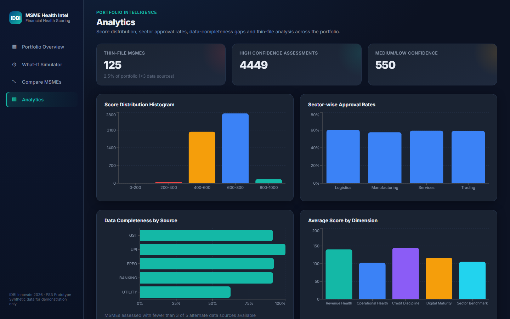
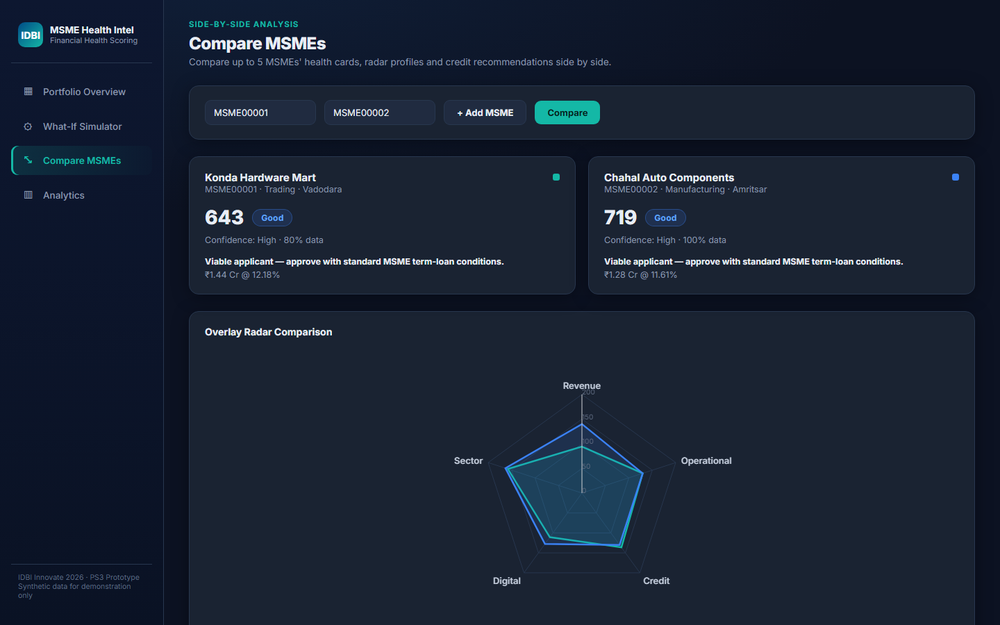
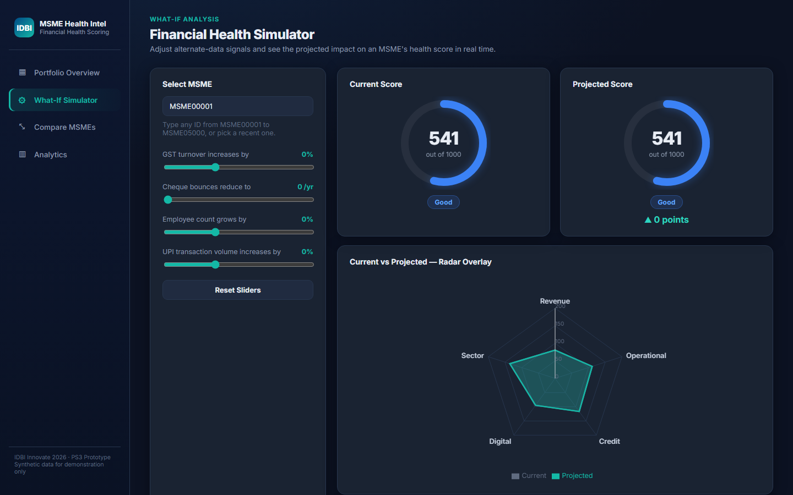
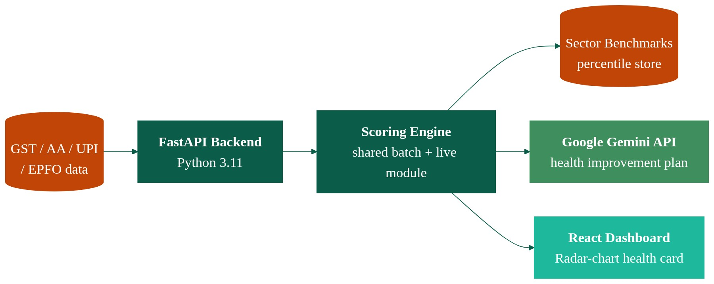

# PS3 — MSME Financial Health Score


> Built for **IDBI Innovate 2026 — Problem Statement 3**. Read [`DISCLAIMER.md`](DISCLAIMER.md)
> before treating anything here as more than a proof of concept — all data is synthetic and
> the score is a decision-support signal, not a real credit decision.

## Why this exists

Only a minority of India's registered MSMEs have ever accessed formal credit, largely
because traditional underwriting expects audited financials, collateral, and multi-year
banking relationships that most small businesses simply don't have. A shopkeeper filing
GSTR-3B on time, paying EPFO contributions regularly, and running a growing UPI counter is
demonstrating real creditworthiness — it just isn't shaped like a balance sheet.

This project scores MSMEs on **alternate data instead of (or alongside) formal financials**:
GST filings, UPI transaction behavior, EPFO contribution history, Account
Aggregator/banking signals, and utility consumption. The goal is a financial health engine
that never auto-rejects a thin-file applicant outright — it returns a score plus an explicit
confidence indicator, so a New-to-Credit or New-to-Bank MSME can still be evaluated on
cash-flow evidence.

## Key features

Everything below is implemented and verifiable in code (see file references) — nothing here
describes a feature that only exists in a slide.

- **5-dimensional weighted health score (0-1000)** — Revenue Health (GST, 30%), Operational
  Health (EPFO/utility/years-in-business, 20%), Credit Discipline (Banking/AA, 25%), Digital
  Maturity (UPI, 10%), Sector Benchmark (15%). Weights and the scoring math live in
  [`backend/scoring/engine.py`](backend/scoring/engine.py).
- **Six alternate-data signals, not just electricity.** The generator and scoring engine both
  genuinely implement:
  - GST turnover growth, filing compliance, input-tax-credit ratio
  - UPI transaction volume/value growth, digital transaction ratio, payment regularity
  - EPFO contribution regularity, employee headcount trend
  - Banking/Account Aggregator: loan repayment history, cheque bounces, debt-to-turnover
    ratio, cash-flow adequacy
  - **Electricity consumption trend** (utility bill)
  - **Water consumption trend** (utility bill; scored only for water-intensive sub-sectors —
    Textiles, Food Processing, Hospitality — where it's a genuine operational signal)
  - **Fuel-expense trend** (separate fleet/fuel-card ledger; scored only for
    Logistics/Trading, where transport spend meaningfully proxies business activity)
- **Never auto-rejects.** ~20% of the synthetic portfolio is deliberately "thin-file" (missing
  GST and/or EPFO and/or Banking). The engine redistributes dimension weights across whatever
  data *is* available and always returns a score plus a `confidence_level` (High/Medium/Low
  based on how many of the 5 core sources are present).
- **What-if simulator** (`POST /simulate`) — project the score impact of a GST turnover
  increase, fewer cheque bounces, employee growth, or UPI volume growth on a specific MSME,
  reusing the exact same scoring function as batch scoring (no drift between "how it was
  scored" and "how the simulator scores it").
- **Explainability** — every health card returns top-3 strengths, top-3 weaknesses, and
  improvement suggestions with an actually-computed estimated point gain (the engine nudges
  the underlying factor toward a near-ideal value and re-scores, rather than showing a canned
  number).
- **Sector benchmarking** — percentile ranking against a precomputed reference distribution
  per sector (turnover proxy, employee count, digital ratio), consistent between batch scoring
  and live `/assess` calls.
- **9 REST endpoints** covering portfolio overview, individual health cards, sector
  benchmarks, live assessment, simulation, side-by-side comparison (up to 5 MSMEs), portfolio
  analytics, and structured export. Full list in
  [`backend/README.md`](backend/README.md#endpoints).
- **React dashboard** (5 routes: Portfolio Overview, Health Card with radar chart, Simulator,
  Compare, Analytics) built with Recharts.

## Screenshots

| Portfolio Overview | Analytics |
|---|---|
|  |  |

| Compare Mode | What-If Simulator |
|---|---|
|  |  |

## Architecture



```
backend/
  scripts/generate_data.py   synthetic 5,000-MSME dataset: profiles + 12-month time series
                              across GST/UPI/EPFO/Banking/Utility(+water)/Fuel, ~20% sparse
  scripts/score_portfolio.py batch-scores the whole portfolio via the shared engine
  scoring/engine.py          THE scoring engine: build_features() + score_from_features(),
                              used by BOTH the batch script and the live /assess, /simulate
                              endpoints, so results are always consistent
  app/schemas.py             Pydantic request models (AssessRequest, SimulateRequest)
  app/main.py                FastAPI serving layer (9 endpoints)
  tests/                     pytest suite for the scoring engine (boundary-value tests)
frontend/
  src/pages/                 PortfolioOverview, HealthCard, Simulator, Compare, Analytics
  src/components/            HealthRadarChart, ScoreGauge, SubScoreCard, StatCard, Layout
```

The frontend calls the FastAPI backend directly over REST (CORS-open for the prototype); the
backend loads the pre-generated CSVs/JSON into memory at startup and serves both pre-batched
and live-computed scores from the same engine module.

## How to run locally

**Backend** (Python 3.11):

```bash
cd backend
py -3.11 -m venv venv
./venv/Scripts/pip install -r requirements.txt      # venv/bin/pip on macOS/Linux

# 1. Generate the synthetic dataset (5,000 profiles, 60,000 monthly records, sector benchmarks)
./venv/Scripts/python scripts/generate_data.py

# 2. Batch-score the portfolio
./venv/Scripts/python scripts/score_portfolio.py

# 3. Serve the API on port 8001
./venv/Scripts/python -m uvicorn app.main:app --reload --port 8001
```

Interactive API docs: http://127.0.0.1:8001/docs

**Frontend** (Node.js, Vite + React):

```bash
cd frontend
npm install
npm run dev -- --port 5174
```

**Tests:**

```bash
cd backend
./venv/Scripts/python -m pytest tests/ -v
```

## Known limitations

| Limitation | Detail |
|---|---|
| All data is synthetic | No real MSME, GSTIN, UDYAM, or bank data is used anywhere — see [`DISCLAIMER.md`](DISCLAIMER.md). |
| Deterministic heuristic, not a trained model | The score is a hand-weighted scoring formula (`backend/scoring/engine.py`), not a model trained/validated on real repayment outcomes. Unlike this hackathon's default-prediction problem statement, there is no AUC-ROC or out-of-time validation here — it isn't a classifier. |
| No OCEN/ULI integration | No code in this repo calls, mocks, or connects to OCEN or the RBI's Unified Lending Interface. Any such framing in project materials is illustrative readiness, not a live integration or a specific lender count. |
| No persistence layer | Data is served from in-memory CSV/JSON loaded at startup; there is no database, and `/assess` results for arbitrary new MSMEs are not saved. |
| No authentication | The API and frontend have no auth/access control — not suitable to expose beyond a local demo. |
| CORS is wide open | `allow_origins=["*"]` in `backend/app/main.py`, fine for a local prototype, not for production. |
| Single-point-in-time scoring | Each MSME has one 12-month history snapshot; there's no support today for re-scoring the same MSME as new months of data arrive (see roadmap). |
| Fuel/water signals are sector-conditional by design | Water only scores for Textiles/Food Processing/Hospitality and fuel only for Logistics/Trading — this is intentional (avoids treating an irrelevant sector's utility bill as a meaningful signal), but means most MSMEs in the portfolio don't have these two factors contributing to their score. |

## Next phase / roadmap

- **OCEN integration for automated disbursement.** Today the engine stops at a credit
  *recommendation* (suggested amount, rate band, tenure) via `/assess` and `/health-card`.
  The natural next step is wiring that recommendation into an OCEN-style Loan Service
  Provider flow so an eligible MSME's score and recommendation can trigger an actual loan
  application/disbursement handoff to a lender, instead of ending at a dashboard number.
- **Post-disbursement continuous monitoring & early-warning alerts.** The backend README
  already frames continuous monitoring as the differentiator versus one-time underwriting
  tools, but the current implementation only supports a single point-in-time assessment per
  MSME. A real next phase would re-score MSMEs as new monthly GST/UPI/EPFO/banking/utility
  data lands, track score trajectory over time, and raise an early-warning alert (e.g. a
  sustained score decline, a spike in cheque bounces, or a sharp electricity-consumption
  drop) for post-disbursement portfolio monitoring — rather than only scoring once at
  underwriting.
- **Richer alt-data breadth beyond the current six signals.** Water-consumption and
  fuel-expense trends are already implemented (see Key Features above) alongside GST, UPI,
  EPFO, and banking. Further candidates for a next phase include e-way bill / logistics data,
  POS terminal data for retail MSMEs, and marketplace/e-commerce sales data for online
  sellers — none of which exist in this prototype today.
- **Move from a hand-weighted heuristic toward a trained/calibrated model** once real
  repayment-outcome data is available, with proper train/test validation (mirroring the
  rigor of this hackathon's default-prediction problem statement).
- **Persistence + auth** — a real database instead of in-memory CSVs, and access control
  before this could be exposed beyond a local demo.
